# Waveform Module
This tool facilitates creating waveforms for simulations or measurements. With this module, users create waveform objects, which define a computational graph for computing a waveform (a 1D numpy array). Arbitrarily complex waveforms may be constructed by composing primitive waveform types. The waveform defined by an object is not actually calculatd until the user gets the `waveform` attribute. Once computed, waveforms are stored in a global cache until objects from which they are derived change state or are deleted. 


```python
import waveform as wf
import numpy as np
import matplotlib.pyplot as plt
%matplotlib inline
```

## Primitive Waveform Types
Each primivites type has a unique set of properties and implements a function that takes these properties and returns a waveform.
### *class* waveform.\_primitives.**Step**(tBefore=0.1, tStep=0.8, tAfter=0.1, offset=0, height=1, dt=0.0001)
        dt = 0.0001      Sampling period, in sec
        tBefore = 0.1    Duration at offset before ramp, in seconds
        tStep = 0.8      Duration of ramp, in seconds
        tAfter = 0.1     Duration at offset after ramp, in seconds
        offset = 0       Offset from zero
        height = 1       End value of the ramp, relative to offset 


```python
step = wf.Step()
step.plot();
```


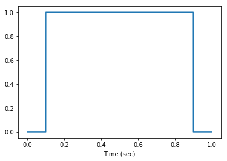


### *class* waveform.\_primitives.**Ramp**(tBefore=0.1, tRamp=0.8, tAfter=0.1, offset=0, height=1, dt=0.0001)
    dt = 0.0001,     Sampling period, in sec
    tBefore = 0.1    Duration at offset before ramp, in seconds
    tRamp = 0.8      Duration of ramp, in seconds
    tAfter = 0.1     Duration at offset after ramp, in seconds
    offset = 0       offset from zero
    height = 1       End value of the ramp, relative to offset


```python
ramp = wf.Ramp()
ramp.plot();
```


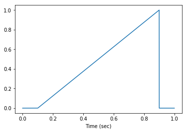


### *class* waveform.\_primitives.**StepRamp**(tOn=0.1, tOff=0.1, heightFirst=0.2, heightLast=1, offset=0, Nsteps=5, dt=0.0001)
        dt = 0.0001,            Sampling period, in sec
        tOn = 0.1,              Duration of pulse, in seconds
        tOff = 0.1,             Duration of time between pulses, in seconds
        heightFirst = 0.2,      Amplitude of the first pulse relative to offset
        heightLast = 1,         Amplitude of the last pulse relative to offset
        offset = 0,             Offset value from 0
        Nsteps = 5,             Number of steps, postive integer


```python
step_ramp = wf.StepRamp()
step_ramp.plot();
```


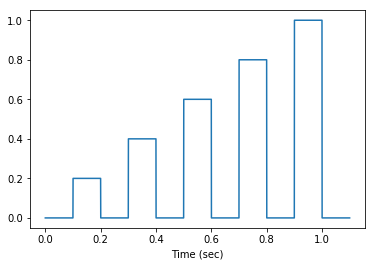


### *class* waveform.\_primitives.**SquareWave**(f=50, phase=0, height=1, duty=0.5, offset=0, t=1, dt=0.0001)
    dt = 0.0001     Sampling period, in sec
    t = 1           Total time, in seconds
    f = 50          Frequency, in Hz
    phase = 0       Phase offset, in radians
    duty = 0.5      Duty cycle (fraction of on vs off)
    height = 1      Height of pulses above offset
    offset = 0      Offset value from 0


```python
square_wave = wf.SquareWave(f=10)
square_wave.plot();
```


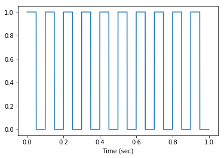


### *class* waveform.\_primitives.**TriangleWave**(f=50, phase=0, height=1, offset=0, t=1, dt=0.0001)
        dt = 0.0001     Sampling period, in sec
        t = 1           Total time, in seconds
        f = 50          Frequency, in Hz
        phase = 0       Phase offset, in radians
        height = 1      Height of pulses above offset
        offset = 0      Offset value from 0


```python
triangle_wave = wf.TriangleWave(f=10)
triangle_wave.plot();
```


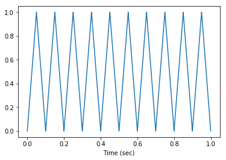


### *class* waveform.\_primitives.**SinWave**(f=50, phase=0, height=1, offset=0, t=1, dt=0.0001)
        dt = 0.0001     Sampling period, in sec
        T = 1           Total time, in seconds
        f = 50          Frequency, in Hz
        phase = 0       Phase offset, in radians
        height = 1      Height of pulses above offset
        offset = 0      Offset value from 0


```python
sin_wave = wf.SinWave(f=10)
sin_wave.plot();
```


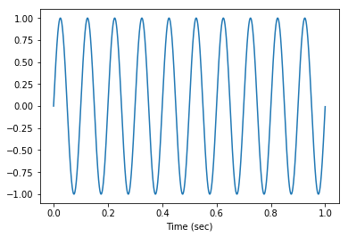


### *class* waveform.\_primitives.**PulseModulated**(fcarrier=50, fmod=1, amod=20, duty=0.5, height=1, offset=0, dt=0.0001, t=1)
Pulse train of constant duty cycle (mean stimulus) and sin-modulated frequency.

        dt = 0.0001     Sampling period, in sec
        t = 1           Total time, in seconds
        fcarrier = 50   Center pulse frequency, in Hz
        fmod = 1        Modulation frequency, in Hz
        amod = 20       Modulation amplitude, in Hz
        duty = 0.5      Duty cycle (fraction of on vs off)
        height = 1      Height of pulses above offset
        offset = 0      Offset value from 0


```python
pulse_modulated = wf.PulseModulated()
pulse_modulated.plot();
```


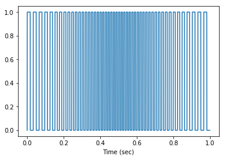


### *class* waveform.\_primitives.**SinVariance**(tau=0.003, I0=1, sigma0=1, dSigma=0.5, sigmaF=0.2, t=1, dt=0.0001)
Ornstein–Uhlenbeck process with constant mean and sin modulated variance. The variance is uniformly distributed and fluctuates over a characteristic timescale.

        dt = 0.0001     Sampling period, sec
        t = 1           Total time of the stimulus, sec
        tau = 0.003     Characteristic timescale of fluctuations, sec
        I0 = 1          Mean value
        sigma0 = 1      Central variance
        dSigma = 0.5    Variance modulation amplitude
        sigmaF = 0.2    Variance modulation frequency, Hz


```python
sin_variance = wf.SinVariance(t=10)
sin_variance.plot();
```


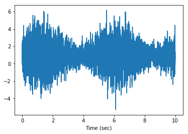


### *class* waveform.\_primitives.**SinAmpMod**(fcarrier=50, fmod=1, amod=1, height=1, offset=0, t=1, dt=0.0001)
Amplitude modulated sin wave.

        dt = 0.0001     Sampling period, in sec
        t = 1           Total time, in seconds
        fcarrier = 50   Carrier frequency, in Hz
        fmod = 1        Amplitude modulation frequency, in Hz
        amod = 1       Modulation amplitude
        height = 1      Height of waveform above offset
        offset = 0      Offset value from 0


```python
sin_amp_mod = wf.SinAmpMod(fcarrier=20)
sin_amp_mod.plot();
```


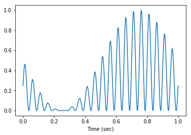


### *class* waveform.\_primitives.**Function**(function, t=1, dt=0.0001)
Creates a waveform from a lambda function. The function takes an array of time values and returns the waveform.

    function        function with signature: np.array wf = f(np.array times)
    dt = 0.0001     Sampling period, in sec
    t = 1           Total time, in seconds


```python
function = wf.Function(function=lambda t: np.sin(t*50) * np.exp(-t*4))
function.plot();
```


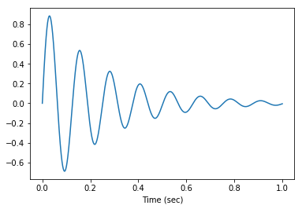


### *class* waveform.\_primitives.**Constant**(value=1, t=1, dt=0.0001)
A constant value waveform.

        value = 1        Value of the waveform 
        dt = 0.0001,     Sampling period, in sec
        t = 1            Duration, in sec


```python
constant = wf.Constant(value=0.5)
constant.plot();
```


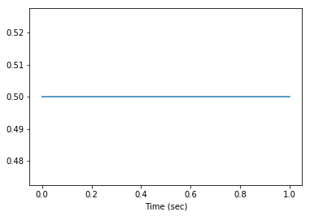


### *class* waveform.\_primitives.**General**(wf, dt)
Allows wrapping an arbitrary numpy array in a waveform object

        wf,    A 1D numpy array of a numeric class
        dt,    Sampling period, in sec


```python
general = wf.General(np.random.rand(10000), 0.0001)
general.plot();
```


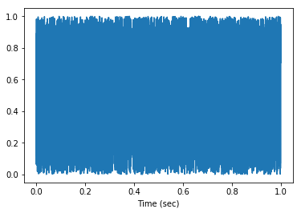


***
## Composite Waveform Types
Composite types contain one or more primitive types as properties. Composites and primitives derive from the same base class and therefore can be used interchanably. 
### _class_ waveform.\_composites.**Array**(*arglist-or-iterable*)
Custom list class that aggregates waveform objects. The class derives from the builtin `list` class, therefore Array objects can be treated like list, however, the binary operators `+` and `*` are overloaded and do not perform the usual concatenation and repetition (as discussed later). The in-place list methods `extend()` and `append()` can be used instead of the `+`. The `waveform` and `times` attributes of Array objects are simply the concatenated arrays of the aggregated objects. The `duration` attribute is the total duration (i.e., sum of) of the aggregated objects. Any waveform objects may be aggregated, including other Array types. 


```python
wf_array = wf.Array( step, ramp, step_ramp )     # arglist
wf_array = wf.Array([step, ramp, step_ramp])     # list or tuple
wf_array.plot();
```


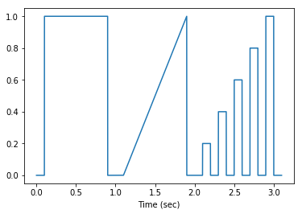


### *class* waveform.\_composites.**Map**(waveform_object, function)
Maps the values of a waveform to other values according to a mapping function. This class is useful in accounting for nonlinearities in light intensity modulation devices, such as Pockel's cells and AOTFs. In this case, the Map serves to map from fractional intensity to voltage.

    waveform_object,    Any waveform object
    function,           Function with signiture np.array wf = f(np.array wf)


```python
ramp = wf.Ramp()
mapped_ramp = wf.Map(ramp, lambda wf: np.sin(wf*np.pi/2))
ax = plt.axes()
ramp.plot(ax)
mapped_ramp.plot(ax);
ax.legend(["ramp", "mapped_ramp"]);
```


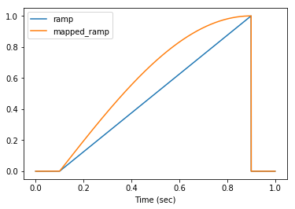


### *class* waveform.\_composites.**Shutter**(waveform_object, level=0, tbefore=5, tafter=5)

Shutter is special case of Map; it maps a waveform to a logical waveform that is true whenever `waveform > level`. We often use these to drive shutters, where the consumed waveform is used to drive an analog modulation device. To account for inertial delays in mechanical shutters, the resulting waveform will be true 'tbefore' each rising edge and 'tafter' each falling edge, with these times given in milliseconds.

    waveform_object,    Any waveform object
    level = 0,          Threshold above which waveform is true
    tbefore,            Rising edges are retarded by this value, ms
    tafter,             Falling edges are advanced by this value, ms


```python
step = wf.Step(height = 2)
shutter = wf.Shutter(step, 0, 50, 50)
ax = plt.axes()
step.plot(ax)
shutter.plot(ax);
ax.legend(["step", "shutter"]);
```


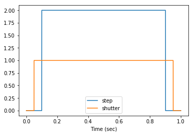


### *class* waveform.\_composites.**PulseRate**(waveform_object, initial_val=0.5, ton=0.001, height=1, offset=0)
Creates a pulse train where the instantanteous pulse rate is given by an arbitrary rate function. An absolute value is applied to the rate function as 'negative rates' are not meaningful. The waveform attribute of the waveform_object defines the rate function.

    waveform_object   Waveform object defining the rate function
    initial_val = 0.5 Number between 0 and 1; With 1 first pulse is at t = 0
    ton = 0.001       Duration of each pulse
    height = 1        Height of pulses above offset
    offset = 0        Offset value from 0


```python
rate_fun = wf.TriangleWave(height=40, f=1, t=2)
pulse_rate = wf.PulseRate(rate_fun, ton=0.01, height=10)
ax = plt.axes()
rate_fun.plot(ax)
pulse_rate.plot(ax);
ax.legend(["rate_fun", "pulse_rate"]);
```


***
## Binary operations
Binary operations `+`, `-`, `*`, and `/` are overloaded to enable basic algebraic composition of waveform objects. For the operation to be valid, the waveforms on either side of the operation must have identical time arrays (same sample rates and durations), or one of the operands must be a numeric scalar (*num*). Each operation returns an instance of a binary composite object, as listed in the table below.

| Operation        | Returned object          |
|-----------------------|-----------------------------------------------------|
| wf_obj `+` wf_obj     | *class* waveform.\_waveform.**\_Add**(obj1, obj2)  |
| wf_obj `+` *num*      | *class* waveform.\_waveform.**\_Add**(obj1, obj2)  |
| *num* `+` wf_obj      | *class* waveform.\_waveform.**\_Add**(obj1, obj2)  |
| wf_obj `-` wf_obj     | *class* waveform.\_waveform.**\_Sub**(obj1, obj2)  |
| wf_obj `-` *num*      | *class* waveform.\_waveform.**\_Sub**(obj1, obj2)  |
| *num* `-` wf_obj      | *class* waveform.\_waveform.**\_rSub**(obj1, obj2) |
| wf_obj `*` wf_obj     | *class* waveform.\_waveform.**\_Mul**(obj1, obj2)  |
| wf_obj `*` *num*      | *class* waveform.\_waveform.**\_Mul**(obj1, obj2)  |
| *num* `*` wf_obj      | *class* waveform.\_waveform.**\_Mul**(obj1, obj2) |
| wf_obj `/` wf_obj     | *class* waveform.\_waveform.**\_Div**(obj1, obj2)  |
| wf_obj `/` *num*      | *class* waveform.\_waveform.**\_Div**(obj1, obj2)  |
| *num* `/` wf_obj      | *class* waveform.\_waveform.**\_rDiv**(obj1, obj2) |

***
## Abstract Base Classes
It is easy to define new waveform types, but doing so requires knowing a bit about the abstract classes from which the various flavors are derived. This section briefly summarizes these classes. 
### *class* waveform.\_waveform.**\_WaveformABC**( )
This is the base class. Primitive objects inherit directly from it, while composites (excluding Array) inherit from intermediate abstract classes. This class defines the main user interface. 

##### *abstract* **get_waveform**( )
Must be implemented in all concrete classes. Not directly called by the user.
##### **waveform**
Getter; Returns the waveform as a 1D numpy array
##### **times**
Getter; Returns a 1D numpy array of time values, in seconds. First element is zero.
#####  **duration**
Getter; Returns the total time of the waveform, in seconds.
#####  **setattrs**(*keyward-args*)
Allows setting multiple attributes at once, i.e., `obj.setattrs(height=1, offset=0)`. If type is Array, the call is forwarded to each child.
##### **get_homogeneous_dt**( )
This method returns a scalar value for `dt` if all primitives that comprise the object have the same value of `dt`, otherwise it raises an exception. 
##### **plot**(\*args, \*\*kwargs)
Produces a plot of `times` versus `waveform`. If the first argument is an instances of matplotlib `Axes`, then the plot will appear on that axis. Otherwise a new figure is created. All remaining arguments are passed to `plt.plot()`.
##### **clear_cache**( )
Globally empties the waveform cache. 
##### **_cache**
Instance attribute. Stores a reference to the WaveformCache object.

### *class* waveform.\_waveform.**\_BinaryComposite**(obj1, obj2)
Derives from `_WaveformABC`. Arguments obj1 and obj2 are waveform objects with identical time signatures. Attribute getters (other than `waveform`) are simply pass the call onto obj1. Derived classes only need to implement the abstract method `get_waveform()` that is called by the `waveform` attribute getter. Waveforms of objects that derive from this class will be cached once computed. 
##### *abstract* **get_waveform**( )
Must be implemented in all concrete classes. Not directly called by the user.


### *class* waveform.\_waveform.**\_UnaryComposite**(waveform_object)
Derives from `_WaveformABC`. Unary composites, such as Map and PulseRate, derive from this class. It's function to `_BinaryComposite`.
##### *abstract* **get_waveform**( )
Must be implemented in all concrete classes. Not directly called by the user.

## Waveform Caching
Excluding Array, all waveform objects will store the result of the `get_waveform()` call into a global dictionary hashed by the object id's. By using a centralized cache, it is trivial to dump the entire cache by calling the `clear()` method. If a waveform object goes out of scope (is deleted by the garbage collector), its waveform data is automatically removed from the cache. The cache object is the instance of singleton *class* waveform.\_waveform.**WaveformCache**. Only the abstract Waveform classes interface with the cache. Users need not consider it when defining concrete classes, however, to disable caching of a particular waveform type, simple redefine a `waveform` getter in the base class that does not write to the cache (see types Array or General). 
